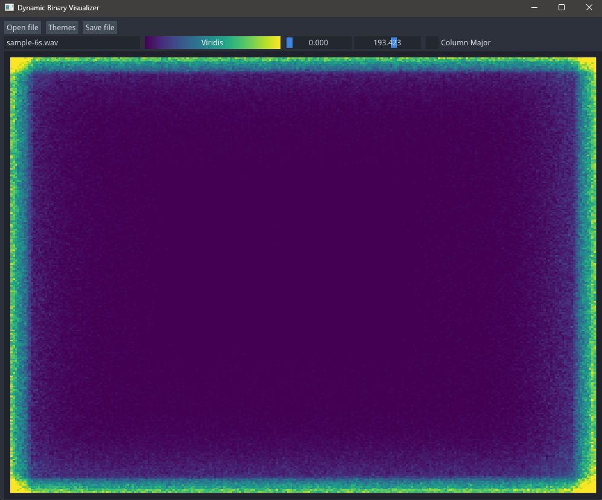
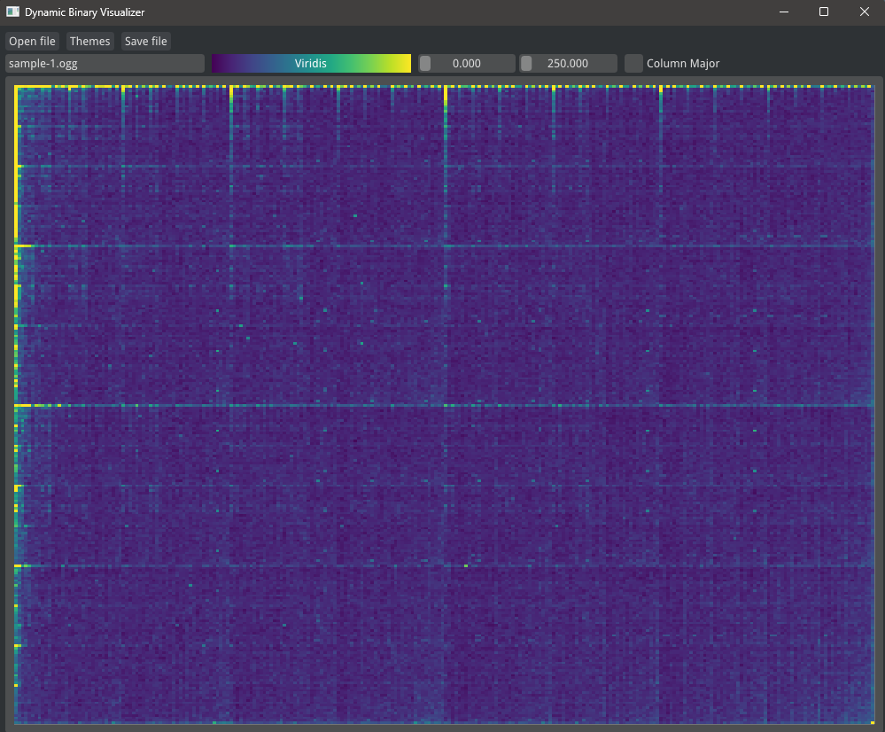
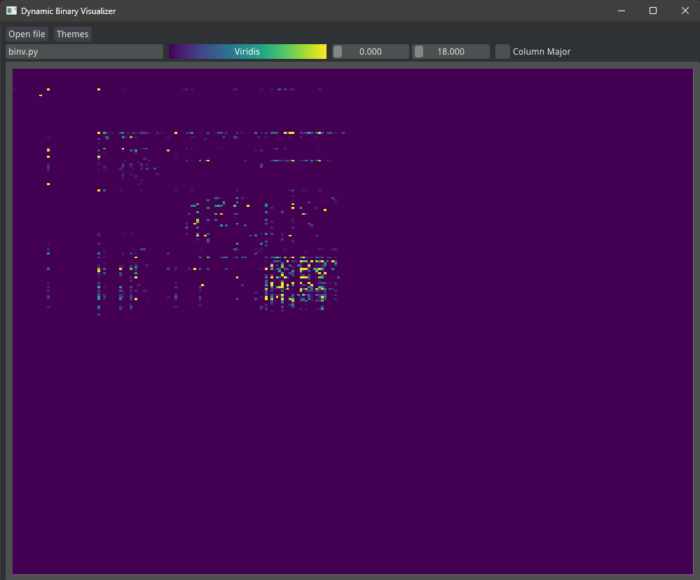

Dynamic **BIN**ary **V**isualization is a way to visualize file binaries independent to their file formats.

## Usecases
- Predicting the class of new file formats without having prior knowledge.
- Reverse engineering binaries.

## Screenshots

### .WAV file


### .OGG file



### binv.py


## Installation
``` console
pip install imgui[full] numpy
```

## Running
``` console
python binv.py
```

## Credits
- Concept: https://www.youtube.com/watch?v=4bM3Gut1hIk
- WAV file: https://samplelib.com/sample-wav.html
- OGG file: https://getsamplefiles.com/sample-audio-files/ogg